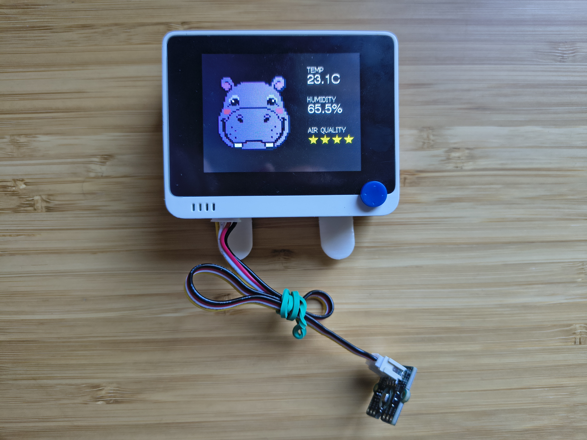
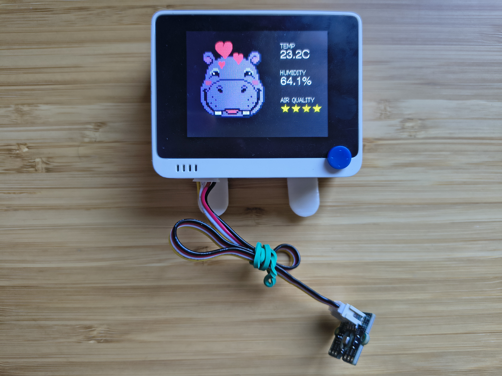
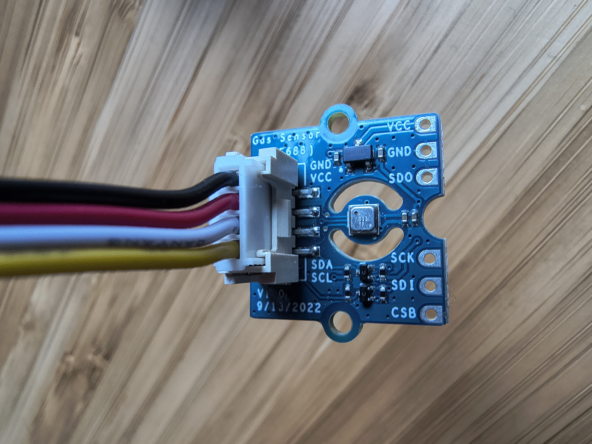
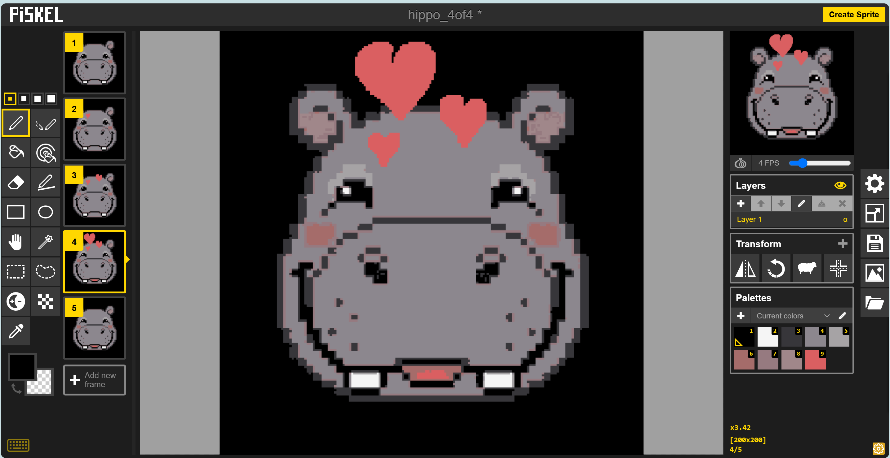

# Atmo 🦛

By **Javi Jorganes** — vibe-coded with [Claude Code](https://claude.com/claude-code).

A desk air-quality companion that doesn't show you a number — it shows
you a face.

Atmo reads the air around it and expresses how clean or polluted it is
through a small animated hippo on a screen, instead of a dashboard full
of numbers. Good air, and Atmo's happy — hearts float up and its cheeks
go pink. Bad air, and it looks worried, sweats, and huffs.

  
  

## The four moods

Atmo has four moods, one per air-quality band, each with its own small
idle animation so it never looks frozen. Mood changes are picked live
from a real gas sensor — nothing here is scripted or random.

| 4/4 — Good | 3/4 — Average |
|:---:|:---:|
|  |  |
| Hearts rise, cheeks blush, mouth opens | Ears twitch, nostrils flare |

| 2/4 — Bad | 1/4 — Very bad |
|:---:|:---:|
|  |  |
| Brow furrows, eyes narrow | Blinks, a sweat drop rolls down, huffs a breath |

## How does it actually know the air quality?

The sensor at the heart of Atmo (a **BME688**) doesn't "smell" the air
the way we do — it has a tiny heated element whose electrical resistance
changes when certain gases touch it. Cleaning products, alcohol, paint,
cooking fumes, even your own breath all release **VOCs** (volatile
organic compounds — basically, molecules that evaporate easily into the
air). More VOCs in the air means a bigger resistance change.

A Bosch software library called **BSEC** takes that raw resistance
reading and turns it into a single, easy number: the **IAQ index**,
running from 0 (spotless air) to 500 (seriously polluted). Atmo just
watches that number and picks a mood to match:

| IAQ score | Mood |
|---|---|
| 0–50 | 😊 4/4 — good |
| 51–100 | 🙂 3/4 — average |
| 101–200 | 😟 2/4 — bad |
| 201+ | 😰 1/4 — very bad |

These bands are the same ones Bosch itself publishes for interpreting
IAQ — not something invented for this project.

One catch: right after power-on, BSEC hasn't "learned" what normal air
looks like yet, so its first readings are marked low-confidence
(accuracy 0) until it calibrates — usually a few minutes.

### Peek at the raw number

Curious what the actual IAQ value is at any moment? Hold down the
Wio Terminal's joystick (press it straight in) and the live IAQ number
appears at the bottom of the screen for as long as you hold it — handy
for testing (e.g. holding rubbing alcohol near the sensor and watching
the number climb).

## What it's built from

- **[Seeed Wio Terminal](https://www.seeedstudio.com/Wio-Terminal-p-4509.html)**
  — an all-in-one microcontroller with a built-in 320×240 screen, a
  5-way joystick, and Grove connectors. Runs the entire project by
  itself, no separate computer needed.
- **[Wio Terminal Battery Chassis](https://www.seeedstudio.com/Wio-Terminal-Chassis-Air-Quality-Kit-p-5228.html)**
  — snaps onto the back, adds a battery and more Grove ports, so Atmo
  can sit anywhere on a desk without a cable.
- **[BME688](https://www.seeedstudio.com/Grove-Gas-Sensor-BME688-p-4816.html)**
  gas/environmental sensor — the thing actually reading the air
  (temperature, humidity, and the gas signal IAQ is calculated from).
  Connects over a single Grove cable, no soldering.

Everything talks over Grove's plug-and-play 4-pin I2C connectors —
literally clip the sensor cable in and it works.

### Why the Wio Terminal specifically

This project is a good example of why the Wio Terminal is such a
convenient board for physical prototyping: it already has a screen,
buttons, a battery option, and a library of plug-in Grove sensors, so
there's no breadboarding, no soldering, and no separate display module
to wire up. You go from an idea to something running on your desk very
quickly — most of the actual effort here went into the software, not
the hardware.

## How this was actually built

This project was **vibe-coded** — built through conversation with
[Claude Code](https://claude.com/claude-code), an AI coding assistant,
rather than hand-writing every line myself.

The split of work was roughly:

- **The hippo's look and its animations — I made those myself**, using
  [Piskel](https://www.piskelapp.com/) (a free browser pixel-art
  editor). This turned out to be the main challenge of the whole
  project: Claude Code can improvise *small* animation touches
  reasonably well (a blink, a small repositioned detail), but it can't
  reliably invent a whole new pose or a convincing multi-frame animation
  on its own — a couple of attempts at that produced results I wasn't
  happy with. So instead, I drew each mood's face and its animation
  frames myself, frame by frame, which also meant I could already see
  exactly how an animation would move *before* it ever reached the
  device. Each frame was drawn on a **200×200 pixel** canvas — that size
  was chosen because the screen is 320×240 pixels total, and 200×200
  is the largest square that comfortably fits the face on the left side
  of the screen while still leaving room on the right for the
  temperature, humidity, and star readout. Finished frames were
  exported from Piskel as a batch of image files and handed to Claude
  Code.
- **Everything else — the actual code — Claude Code wrote**: reading the
  sensor, turning my exported animation frames into working display
  code, the air-quality logic, the on-screen layout, and a fair amount
  of engineering to make it all fit. I described what I wanted and
  reviewed the results; Claude Code implemented it.

One real engineering problem that came up: storing every animation
frame at full color was far too big to fit in the board's memory once
all four moods were combined. The fix was switching every image to a
10-color palette format (since the hippo never actually needs more than
10 colors) instead of full color — a change that shrank the total
storage by more than 4x and made the difference between it fitting or
not.

## Setup

See [`CLAUDE.md`](CLAUDE.md) for wiring, build, and flashing
instructions, and technical detail on how the code is organized.

---

<i>Piskel workflow for one of the moods — drawing each animation frame before exporting it:</i>

